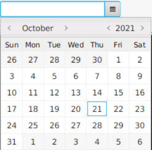

 <div id="top"></div>

<div align="center">
  <a href="https://gitlab.stud.idi.ntnu.no/it1901/groups-2021/gr2172/gr2172">
    
  </a>
 <h1>Diary</h1>
</div>

## Links

[Root readme](../readme.md)
[Backend readme](backend/readme.md)
[Core readme](core/readme.md)
[Frontend readme](frontend/readme.md)

<br/>

## Usage

</br>

The diary should be easy to use. First you pick username and pin code. Then open the application which will start a page at the current date. After writing your diary content, remember to submit the edited page by pushing the "Save entry" button in order to save it, there is no auto-save. The button for submitting is shown below as a screenshot.

</br>


</br>

If you wish to read previous diary entries, select the date picker on the left side of the application. It's also possible to write date in the text editor with dd-mm-yyyy as form, or by clicking the right mark. The date picker is shown as a screenshot below.

</br>



</br>

The arrows on each side of the page is a alternate navigation tool, that can be used instead of the datepicker. This method will only move you one day at a time, a single day forwards or backwards from the current selected date. These arrows are shown on each side of the interface. See the screenshot below.

<br/>


<br/>

For more infomration of the project, plrease refer to the [Documentation](https://gitlab.stud.idi.ntnu.no/it1901/groups-2021/gr2172/gr2172/-/tree/master/docs)\_

<br/>

## Standards

During this project multiple standards and templates have been used. Firstly, have all commit messages been written with the topic of concern, as “documentation”, “ui” or “testing”, followed by the specific changes or features added. By doing it like this it has been easier to keep track of what the different commits regard.

When issues are created have, we strived to make them short and consise. This is to make them easier to read and understand for all team members.
Methods and variables are named in such a way that they may be used by other members in the future without necessarily have to asking or read the method or class to understand. Javadocs also helps here. Getters and setter are obviously called “getter” or “setter” followed by what it sets or gets. Methods in general are called what they do as short as possible. Variables are named after what they are used as.
In all datasets are some deviations, this beeing no exception. Some commits, methods, issues, or variables might therefore not follow these guidelines strictly, though we attempted to minimize the ammount of exceptions.

<br/>

<div align="right">
  <a href="#top">back to top</a>
</div>

## Testing and code verification

<br/>

### Unit tests

---

Code performing important tasks need to be included in at least 1 Junit test method. This is to ensure that written code perform as excepted, both for expected inputs and for unexpected (i.e. throwing correct exceptions).

The adviced procedure is as follows:

1. Write new class/method.

2. Write unit tests for the written class/method

    - Verify that intended input is properly used and returns valid results.
    - Check actions when using invalid input. Correct exceptions, error correction etc. should be tested in this part.

3. If 2. uncover any issues, those issues must be addresses before the new code is pushed/merge to develop.

### Unit test coverage

---

Unit test coverage is measured using [jacoco](https://github.com/jacoco/jacoco). Each modules test coverage is measured and aggregated into a common report available in `diary/testing/target/site/jacoco-aggregate/index.html`.

The project is expected to have test coverage above 70% for each module, except for frontend and backend.
For gitlab the aggregate test coverage in the main branch is shown as both a project badge as well as a badge in the root-directory readme.md file.
The UI module will however not be included in the aggregate report, due to javafx tests not working as a headless gitlab pipeline. The aggregate coverage for the overall project is therefore set at 50% minimum.
The test regarding the back and frontend folders aren’t written as unit tests but as integration tests. This causes the coverage to not be included in the Jacoco report.

### Checkstyle

---

This project utilizes the `maven-checkstyle-plugin` to maintain a cohesive coding style between every developer. The selected checkstyle profile chosen is a modified version of Google's coding conventions for java. The custom stylesheet is located in `diary/config/custom_checkstyle.xml`.

Warnings from checkstyle is allowed when merging on gitlab, but any branch containing a checkstyle error will not be allowed to be integrated into the master branch.

### Spotbugs

---

The maven spotbugs plugin, spotbugs-maven-plugin, is used to detect well known bugs and insecurities in java code. Any error stemming from spotbugs will prevent the branch from being integrated into the master branch on gitlab.

This project use a spotbugs exclusion list, which contains any spotbugs error that is allowed within the project. This exclusion list is located in `diary/config/spotbugs_exclude.xml`.

Currently three bugs is excluded from bugspot tests. `DLS_DEAD_LOCAL_STORE` is excluded due to usage of `File.delete()` in the persistance layer. The `File.delete()` method returns a boolean value, however currently the project design just needs the file to delete without a return value, which is why the `DLS_DEAD_LOCAL_STORE` is on the exclusion list.

`EI_EXPOSE_REP` and `EI_EXPOSE_REP2` is excluded due to our method of swapping between controllers in the UI module. We intended to limit exposing objects as much as possible, but found no reliable workaround for the UI controller swapping methods. The UI controllers is only location the `EI_EXPOSE_REP2` "bug" is allowed, DiaryApp is the only location the `EI_EXPOSE_REP` bug is allowed. These bugs should not be allowed to occur outside of these specific classes in the UI module.

### How to run test

---

Tests are run in the verify phase of the maven lifecycle. Therefore a any branch can run every test, checkstyle, spotbugs, and jacoco, using the `mvn verify` command.

A daily jacoco coverage report is generated on the master branch on gitlab. While a code coverage percentage can be seen on the master branch badges, a more conclusive report can be downloaded as a artifact from the daily `jacocoReport` job performed under the CI/CD meny or by clicking the `jacoco CI Report` badge. However CI jacoco can't run UI test, so a separate manually compiled jacoco report is available through the `jacoco Full Report` badge.

<br/>

## Making installer and runtime

The project is exported as a runtime, using jlink, and as an installer, using jpackage. The creation of the installer and runtime is done on each operating system (OS) as these utilities can only make usable installers for the currently running OS.

### Prerequisite packages on system

### Linux/Debian

For the linux environment installer we require two non-default packages to be installed first, binutils and fakeroot. In the running gitpod environment we can add these by running the following commands, as described in the [github page for openjdk](https://github.com/jgneff/openjdk#java-platform):

```
sudo apt-get update
sudo apt install binutils fakeroot
```

### Windows

For windows the WiXToolset must be downloaded and installed before you can build the installer using jpackage. WixToolset can be found on their website [wixtoolset.org](https://wixtoolset.org/).

## Creating installer

After the OS specific prerequisite packages has been installed we can make our installer.

First we need to compile our entire project using `mvn compile`, followed by running jlink and jpackage in the ui module.

The following code will complete both these tasks:

```
mvn clean compile
mvn javafx:jlink jpackage:jpackage -f ui/pom.xml
```

After these commands are run the installer and runtime image will be created within the `ui/target` folder. The installer located in the `ui/target/dist` with the runtime contained in `ui/target/diary`.

<br/>

<div align="right">
  <a href="#top">back to top</a>
</div>

## Using runtime and installer

<br/>

### Installers

Generated installers are provided through [folk.ntnu.no](https://folk.ntnu.no/stiankg/IT1901/Installers/).

-   [Windows](https://folk.ntnu.no/stiankg/IT1901/Installers/Windows/)
-   [Linux](https://folk.ntnu.no/stiankg/IT1901/Installers/Linux/)

### Windows

The produced (or provided) .exe file can be ran, in which case the application will be saved to the default position at

```
c:\Program Files\diaryApplication
```

The runable java application is located within the runtime;

```
C:\Program Files\diaryApplication\runtime\bin\diary
```

From a CMD window the app can then be run using the following commands:

```
cd C:\Program Files\diaryapplication\runtime\bin\
diary
```

### Linux / Gitpod

The installer on gitpod would be located within `ui/target/diary/dist`, and can be run using the following command for gitpod:

```
sudo dpkg -i /workspace/gr2172/diary/ui/target/dist/diary-application_1.0.0-1_amd64.deb
```

Local applications need to substitute in their own working directory to provide the path for the .deb file, or double-click the downloaded .deb file if their configuration allows this action.

The install location using this .deb file is to the default install location, `/opt/diaryapplication`. The application can therefore be run using the following commands;

```
cd /opt/diaryapplication/bin/
./diaryApplication
```

Alternatively, if you have just compiled the installer and runtime, the runtime can be directly executed by calling the diary file within the `diary/bin/`, which on gitpod will have the following path:

```
/workspace/gr2172/diary/ui/target/diary/bin/diary
```

<div align="center">
<a href="https://gitlab.stud.idi.ntnu.no/it1901/groups-2021/gr2172/gr2172">
  
</a>
 <h3 align>Group2172</h3>
</div>
<div align="right">
  <a href="#top">back to top</a>
</div>
