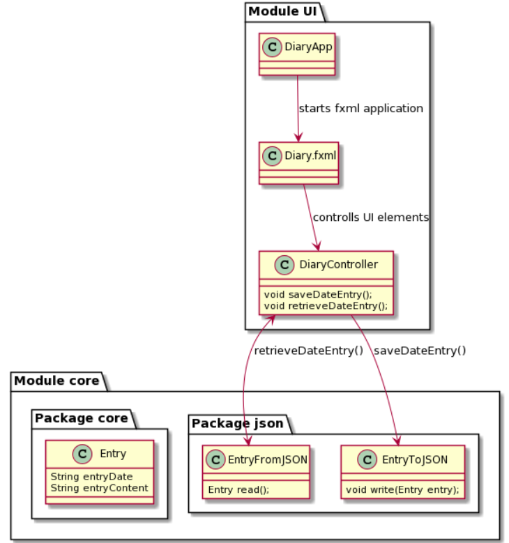

 

 <!-- PROJECT TITLE -->
 

  
  <h1>Release 2</h1>
  

    <a href="https://gitlab.stud.idi.ntnu.no/it1901/groups-2021/gr2172/gr2172"><strong>Back to Root</strong></a>
  

  
 
  

## Intro 

In this release we have updated the skeleton we created in release 1 to be a modular application, dividing it into the Core and the UI modules. We have also moved the project below the root gitlab folder to make it tidier. We have written av few more tests, scaled back on functionality it turned out we didn't need (such as the application being able to write to several different diaries) and overall made several small fixes. In addition, we wrote this PlantUML diagram, to clearly illustrate how the application functions:

 
 
 

 
 
 

    

  

  

## Modularisation
For this project were the requirements to execute modularization for the whole project. What this means is to locate modules within a proper structure of folders and files. We have therefore moved the core and the ui folders in separate location. Within these folders are several other folders created as well, as well as the main poms of the modules. The main pom should contain all dependencies and potential profiles and plugins of the current module. We also created separated poms within the folders you find with the main poms. The different modules may appear differently, as they doesn’t necessary have to be structured similar to each other. 

 

### The UI module
By opening the ui module three elements should occur. The main ui pom, and two folders. The src folder contains tests and main classes. The test folder contains as the name suggests, test of ui classes. While the main folder is a bit more filled. Firstly, will a java folder occur in main where java classes are held such as the app class and the controller. The resources folder contains images and fxml documents. 
  

### The core module
Like ui, does core have three elements. The main pom, as we have explained is necessary, and src and target. The src is where all logic is defined, as well as tests. The tests are just like for ui. The logic we define the application with is mainly found by opening main, then the java and diary folder will core occur. The brain of our application. By its side is json, where local storage is defined. By going back, the level of the first layer of core is target also found. Target is auto generated with maven and shouldn’t be of worry.

 
 
## Work habits
Throughout working on the project, we have had biweekly meetings where we have identified and assigned issues, in addition to helping eachother with the troubles of git and maven. Off meetings we engage alot in pair programming through screensharing over discord, and when we don't, usually for some minor bugfix, we quickly ask eachother for help when stuck. This keeps us as efficient as we need to be, without spending more time on the project than needed.

 

 

 

 <h3 align>Group2172</h3>

  <a href="#top">back to top</a>

