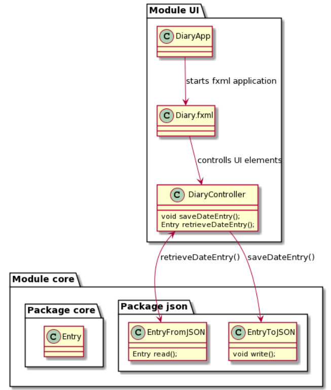

# Realease 2
In this release we have updated the sceleton we created in release 1 to be a modular application, dividing it into the Core and the UI modules. We have also moved the project below the root gitlab folder to make it more tidy. We have written av few more tests, scaled back on functionality it turned out we didn't need (such as the application beeing able to write to several different diaries) and overall made several small fixes. In addition, we wrote this PlantUML diagram, to clealy illustrate how the application functions:

  
  

# Work habits
Throughout working on the project we have had biweekly meetings where we have identified and assigned issues, in addition to helping eachother with the troubles of git and maven. Off meetings we engage alot in pair programming through screensharing over discord, and when we don't, usually for some minor bugfix, we quickly ask eachother for help when stuck. This keeps us as efficient as we need to be, without spending more time on the project than needed.
