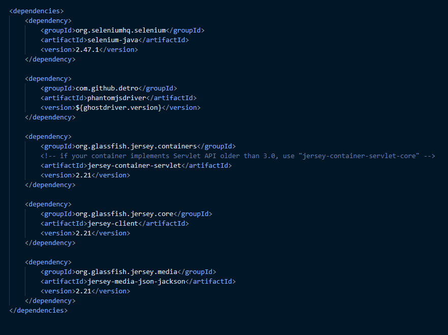

 <!-- PROJECT TITLE -->
 

  
  <h1 align="center">Release 3</h1>
  

     
    <a href="https://gitlab.stud.idi.ntnu.no/it1901/groups-2021/gr2172/gr2172"><strong>Back to Root</strong></a>
     
     
    <a href="https://gitlab.stud.idi.ntnu.no/it1901/groups-2021/gr2172/gr2172/-/issues">Issues</a>
    ·
    <a href="https://gitlab.stud.idi.ntnu.no/it1901/groups-2021/gr2172/gr2172/-/commits/master">Commits</a>
    ·
    <a href="https://gitlab.stud.idi.ntnu.no/it1901/groups-2021/gr2172/gr2172/-/project_members">Members</a>
  

<!-- TABLE OF CONTENTS -->

  
Table of Contents

  <ol>
    <li>
      <a href="#about-project-3">About Project 3</a>
    </li>
    <li>
      <a href="#headless-testing">Headless Testing</a>
    </li>
    <li><a href="#rest-api">Rest-API</a></li>
    <li><a href="#deployment">Deployment</a></li>
    <li><a href="#work-schedule-and-habits">Work schedule and habits</a></li>
    <li><a href="#contact">Contact</a></li>
    <li><a href="#java-fx">JavaFX</a></li>
  </ol>

<!-- ABOUT PROJECT 3 -->
 

## Intro 

<!-- HEADLESS TESTING-->

## Headless

During project 3 did all members establish a curiosity about headless testing, how it works and how it may be included in the CI and Jacoco report. A great amount of extra time has therefor been spent trying to implement headless testing. We managed to test the application headless as the result. However, we didn't manage to create or find a monocle library the docker-image could use to make it readable to Gitlab. Even though we didn't reach our goal did the process teach us a fair amount about how headless testing works and what it takes to create necessary properties it depend on. 

Another technology we tried to use in order to implement headless testing was [selenium](https://www.selenium.dev/). By simply running a Selenium test using a headless browser that operates as your typical browser, but without a user interface, making it to automated testing. We tried to make the docker image to download two browsers (chrome and firefox) intending to open the application on a VM from GitLab. We did get closer to the final goal. However, one issue stopped us reaching it. The maven surefire dependency had conflicts. 

As Phantom and Karma also had some issues with gitpod and are easier to use with JAR we had to accept the failure and rather keep going on the actual project. Our ideal approache 

<!-- REST API -->

## Rest API

<!-- DEPLOYMENT-->

## Deployment

<!-- WORK SCHEDULE AND HABITS-->

## Work Habits

<!-- JAVA FX-->

## Java FX

<!-- CONTACT -->

## Contact 