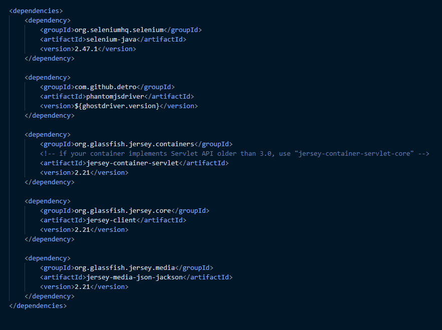

 

 <!-- PROJECT TITLE -->
 

  
  <h1>Release 3</h1>
  

    <a href="https://gitlab.stud.idi.ntnu.no/it1901/groups-2021/gr2172/gr2172"><strong>Back to Root</strong></a>
  

<!-- TABLE OF CONTENTS -->

  
Table of Contents

  <ol>
    <li>
      <a href="#about-project-3">About Project 3</a>
    </li>
    <li>
      <a href="#headless-testing">Headless Testing</a>
    </li>
    <li><a href="#rest-api">Rest-API</a></li>
    <li><a href="#deployment">Deployment</a></li>
    <li><a href="#work-schedule-and-habits">Work schedule and habits</a></li>
    <li><a href="#contact">Contact</a></li>
  </ol>

<!-- ABOUT PROJECT 3 -->
 

## Intro

In this readme file you can find specifics related to release three. Because of this assignments heavy influence on grades we have spent hundreds of hours finishing our application. It’s been an interesting journey, to say the least.

<!-- HEADLESS TESTING-->

## Headless

By the release of project 3 all members had developed a curiosity of various technologies. Headless testing among them. How headless works and how it may be included in the CI and Jacoco report from Gitpod. A great deal of extra hours has therefore been spent trying to implement headless testing. We managed to test the application headless quickly after beginning, however we didn't manage to create or find a monocle library the docker-image could use to make it readable by Gitlab. This part was about to be real time consumer. Even though we didn't reach our goal the sub-project taught us a fair amount about how headless testing works and what it takes to create the necessary properties it depends on. 

Another technology we tried to use to implement headless testing was [selenium](https://www.selenium.dev/). By simply running a Selenium test using a headless browser that operates as your typical browser, but without a user interface, we intended to include the testfx execution to the CI. We tried to make the docker image composed of two browsers, chrome and firefox, for then finding out Gitlab only accepts chrome. With the intension of opening the application on a VM from GitLab. We did get closer to the final goal, however one issue stopped us reaching it. The maven surefire dependency had quite a lot of conflicts. As Phantom hasn’t been updated for many years and Karma doesn’t support Java with Maven build properly and most other solutions was explicit meant for JAR, we had to accept the failure and instead keep it going on the actual project. Our ideal approach would be the one below if it would run:

<!-- REST API -->

## Rest API

In this release we implemented a REST-api, which saves any diaries the user creates to the server. The server is quite simple, only supporting GET to retrieve diaries and POST to store diaries. We still store diaries locally, as a simple form of cache. The backend starts automatically when the repository is opened in gitpod. To read more about how the API functions and what commands are needed to start it, visit the [readme.md](../../diary/backend/readme.md) in diary. Using the provided installers to run application would not allow interaction with the REST API, as the REST API does not have a permanent, publicly available server to run from.

When we added a common server to be used by several users, we also required a way to distinguish which diaries belonged to which user. Our approach was to add a simple login with username and pin. There is no validation here, but this simple change allows us to store several diaries of the same name to the server. Because of this the "login" has no validation, besides the format of the pin (a four digit number).

<!-- DEPLOYMENT-->

## Shippable Program

The local version of the diary application can now be provided as a java runtime or as a installable version.

Use of the installable version allows anyone to utilize the diary application without having to install java and maven. The saved diary files are stored in the users home directory, within a diary folder. However as mentioned in [Rest API](#Rest-API) installed version can't retrieve or store data on a remote server.

To install the diary application simply run the installation medium as specified in the [diary readme](../../diary/readme.md#Making-installer-and-runtime), the required runtime will then be available to start the application.

<!-- WORK SCHEDULE AND HABITS-->

## Work Habits

All members have been working almost daily. With multiple sleepless nights and long hours the project has been worked on almost continuously every day of every week.

 

In addition to the long working hours, we have had two to three meeting each week to coordinate and plan the development progress. This has surely benefitted us in organizing and working efficiently. We considered tracking working hours but decided not to, in hindsight we regret this decision as time tracking would have allowed us to see exactly how much time we have invested in the project.

<!-- CONTACT -->

## Contact

 
<!-- Alphabetical first-name order -->

-   Jakob Lien - [@jlien11](https://github.com/jlien11) - jakobli@stud.ntnu.no
-   Lars Overskeid - [@Lars-over](https://github.com/Lars-over) - larsover@stud.ntnu.no
-   Sebastian Veum - [@nazgul735](https://github.com/nazgul735) - sebasv@stud.ntnu.no
-   Stian Gaustad - [@StianKGaustad](https://github.com/StianKGaustad) - stiankg@stud.ntnu.no

<!-- Alphabetical last-name order -->
<!--
-   Stian Gaustad - [@StianKGaustad](https://github.com/StianKGaustad) - stiankg@stud.ntnu.no
-   Jakob Lien - [@jlien11](https://github.com/jlien11) - jakobli@stud.ntnu.no
-   Lars Overskeid - [@Lars-over](https://github.com/Lars-over) - larsover@stud.ntnu.no
-   Sebastian Veum - [@nazgul735](https://github.com/nazgul735) - sebasv@stud.ntnu.no
-->
 

**Project Link:** [Diary](https://gitlab.stud.idi.ntnu.no/it1901/groups-2021/gr2172/gr2172)

 

 

 

 <h3 align>Group2172</h3>

  <a href="#top">back to top</a>

