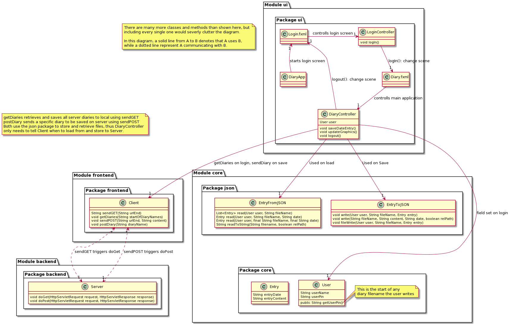
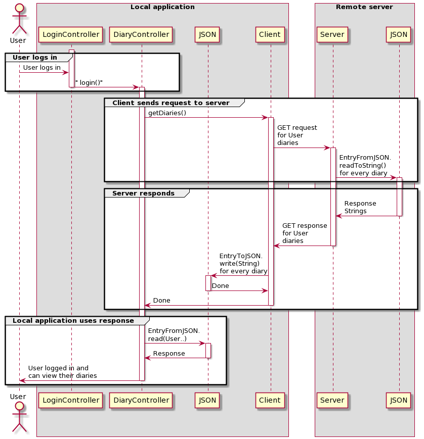

<div id="top"></div>

<!-- PROJECT SHIELDS -->
<div align="center">

[](https://gitpod.stud.ntnu.no/#https://gitlab.stud.idi.ntnu.no/it1901/groups-2021/gr2172/gr2172)

</b>

[](https://gitlab.stud.idi.ntnu.no/it1901/groups-2021/gr2172/gr2172/-/pipelines)

</b>

[](https://gitlab.stud.idi.ntnu.no/it1901/groups-2021/gr2172/gr2172/-/graphs/master/charts)

<!--
*** We find these labels greatly udesful as we recieve a confirmation of status.
*** Pipeline runs tests of the pushed branch rapidly as we push them.
*** After the pipeline test the return is a jacoco report, available for 24h, of the coverage of the FXtests
-->
</div>

<!-- PROJECT TITLE -->
<br />
<div align="center">
<a href="https://gitlab.stud.idi.ntnu.no/it1901/groups-2021/gr2172/gr2172">
    
  </a>
 <h1>Diary</h1>
 <h2> Group2172</h2>
   <p>
    A project assigned in course IT1901 during the first semester of 2021.
    <br/>
    <br/>
    <a href="https://gitlab.stud.idi.ntnu.no/it1901/groups-2021/gr2172/gr2172"><strong>Explore the repository »</strong></a>
    <br/>
    <br/>
    <a href="https://gitlab.stud.idi.ntnu.no/it1901/groups-2021/gr2172/gr2172/-/issues">Issues</a>
    ·
    <a href="https://gitlab.stud.idi.ntnu.no/it1901/groups-2021/gr2172/gr2172/-/commits/master">Commits</a>
    ·
    <a href="https://gitlab.stud.idi.ntnu.no/it1901/groups-2021/gr2172/gr2172/-/project_members">Members</a>
  </p>
</div>

<!-- TABLE OF CONTENTS -->
<details>
  <summary>Table of Contents</summary>
  <ol>
    <li>
      <a href="#about-the-project">About The Project</a>
      <ul>
        <li><a href="#built-with">Built With</a></li>
      </ul>
    </li>
    <li>
      <a href="#getting-started">Getting Started</a>
      <ul>
        <li><a href="#prerequisites">Prerequisites</a></li>
        <li><a href="#installation">Installation</a></li>
      </ul>
    </li>
    <li><a href="#usage">Usage</a></li>
    <li><a href="#license">License</a></li>
    <li><a href="#work-schedule-and-habits">Work schedule and habits</a></li>
    <li><a href="#contact">Contact</a></li>
    <li><a href="#acknowledgments">Acknowledgments</a></li>
  </ol>
</details>

</br>

<!-- ABOUT THE PROJECT -->

## About The Project

<div align="center">
<p>
Class diagram:
</p>
<a href="https://gitlab.stud.idi.ntnu.no/it1901/groups-2021/gr2172/gr2172">

</a>
<p>
Sequence diagram:
</p>
<a href="https://gitlab.stud.idi.ntnu.no/it1901/groups-2021/gr2172/gr2172">

</a>
<p>
Interface:
</p>
<a href="https://gitlab.stud.idi.ntnu.no/it1901/groups-2021/gr2172/gr2172">

</a>
</div>

### General info:

</br>

-   This project creates a simple diary-application that allows the user to write diary entries, save and load them.
-   The root-folder of the project is the top level of the repository. Because of this we have combined the two README-files.
-   Above you may find two screenshots. The first, an illustration of the interface. The second one is of the architecture

</br>

### Built With

</br>

-   [Maven](https://maven.apache.org/)
-   [Monocle]()
-   [Java]()
-   [JavaFX]()


<div align="right">
  <a href="#top">back to top</a>
</div>


<!-- GETTING STARTED -->

## Getting Started

</br>

### **Build Local**

This is a guidance of how you may set up your project locally.
To get a local copy up and running follow these simple steps.

</br>

### Prerequisites

How to set up the environment to use the application and how to install them.

-   Install maven

</br>

### Installation

1. Clone the repository
    ```sh
    git clone https://gitlab.stud.idi.ntnu.no/it1901/groups-2021/gr2172/gr2172.git
    ```
2. Install mvn packages

</br>

### **Run Local**

```
cd diary
mvn clean install
mvn javafx:run -f ui/pom.xml
```

</br>

### **Build Gitpod**

Gitpod is configured to automatically select the diary directory and run `mvn clean install`, application will run using the following:

</br>

### Prerequisites

Theres no need to set the environment to use the application as it is already set in Gitpod

</br>

### **Run Gitpod**

```
mvn javafx:run -f ui/pom.xml
```

 <div align="right">
    <a href="#top">back to top</a>
  </div>


<!-- RUN TESTS -->
## Run Tests
</br>

### **Regular Tests**
```
cd diary/<module>
mvn test
```

### **Headless Tests**
Headless testing is only reasonable to do on UI modules. In order to run an headless test, please follow the steps belove.
```
cd diary/ui
mvn test -P headless
```

<!-- USAGE EXAMPLES -->

## Usage

</br>

The diary sould be easly handled. Open the application and a page for the current date will occur. After writing prefered content, remember to submit the edited page in order to save it. The button for submitting is shown belove.
</br>


</br>

If reading earlier content is of choise, select the date picker on the left side of the button. It's possible to write date in the text editor with dd-mm-yyyy as form, or by clicking the right mark. The date picker is shown as a screenshot belove.

</br>


</br>

For more infomration of the project, plrease refer to the [Documentation](https://gitlab.stud.idi.ntnu.no/it1901/groups-2021/gr2172/gr2172/-/tree/master/docs)\_

</br>

### **Userhistory**

As an imaginative and thoughtful person, I find it necessary to collect my thoughts somewhere. That's why I need some place where I may write down my thoughts to look back at them in the future. That's why I would like a diary capable of storing my thoughts over extended periods of time, with the option to view and edit them later. I highly value my privacy, which is why I want my diary to be secure. To keep my thoughts, secrete I secure the diary with a pin code.

</br>


### **Important features for the user**

-   Login page for security reasons 
-   The submit button saves your current entry to the selected date. (Today by default)
-   Use the datepicker to edit or read the entry for a different date.

  <div align="right">
    <a href="#top">back to top</a>
  </div>


<!-- Work habits -->

## Work schedule and habits

Developers of this project assign standard issues and bugfixes during meetings that occur on wednesdays and fridays. Assigned issues are worked on independantly by the people assigned to the issue, with a deadline for pushing their work related to the issue.

The wednesday and friday meetings is also the primary time where merge requests and group code review are performed. However, any developer can push their features at any time. For large and significant changes only the group meeting is allowed to approve of changes.

Smaller features or changes can be approved by any other developer, after which they can be merge into intended branch immediatly. If such a minor change is desired to quickly be added the develop is to do the following:

-   Create merge request into develop branch.
-   Fill inn all information pertinent to the merge request.
-   Request a review from another developer on GitLab.

    -   The reviewer can also be pinged on the project discord server.

-   Await the reviewer to approve of the changes.

<i>Note: Using the time-spent feature on gitlab is <b>not</b> required for this project. Low familiarity with all gitlab features made some features not be explored for a significant amount of time, time-spent was therefore neglected from the start and the group does not think time-tracking would give any significant benefits to the current work schedule used. </i>

Intended behaviour is merging other branches into the develop branch, however single-file changes minor changes are approved to be pushed directly to develop. After some features and issues is collected in develop the develop branch is pushed to master during a group meeting, this allows develop to work as a stable experimental branch while the master branch is shielded from unintended effects of new features.


### **Working methods**

The preferred working method is pair-programming or pair-review before attempting to merge into a branch. Assigned pair is not fixed and based on current availability, previous work with the issue or part of the code, and general interest in the assigned change. Preferred communication style for the pair programming or review is through the project specific discord server, however review is also acceptable to perform in the GitLab repository.

Information about guidelines for writing tests, compliance with checkstyle, and preferred test coverage can be found in the specific project readme within the diary directory. 

 <div align="right">
    <a href="#top">back to top</a>
  </div>

<!-- CONTACT -->

## Contact

</br>
<!-- Alphabetical first-name order -->

-   Jakob Lien - [@jlien11](https://github.com/jlien11) - jakobli@stud.ntnu.no
-   Lars Overskeid - [@Lars-over](https://github.com/Lars-over) - larsover@stud.ntnu.no
-   Sebastian Veum - [@nazgul735](https://github.com/nazgul735) - sebasv@stud.ntnu.no
-   Stian Gaustad - [@StianKGaustad](https://github.com/StianKGaustad) - stiankg@stud.ntnu.no

<!-- Alphabetical last-name order -->
<!--
-   Stian Gaustad - [@StianKGaustad](https://github.com/StianKGaustad) - stiankg@stud.ntnu.no
-   Jakob Lien - [@jlien11](https://github.com/jlien11) - jakobli@stud.ntnu.no
-   Lars Overskeid - [@Lars-over](https://github.com/Lars-over) - larsover@stud.ntnu.no
-   Sebastian Veum - [@nazgul735](https://github.com/nazgul735) - sebasv@stud.ntnu.no
-->
</br>

**Project Link:** [Diary](https://gitlab.stud.idi.ntnu.no/it1901/groups-2021/gr2172/gr2172)

 <div align="right">
    <a href="#top">back to top</a>
  </div>


<!-- ACKNOWLEDGMENTS -->

## Acknowledgments

</br>

These sources have actively been used during this project. Therefor would we love to give some credit to the content creators of these. Links of the most used ones are included belove. There is, however, many more sources used but five pages of source description would hardly be read by anyone.

-   [Simpleexample2](https://gitlab.stud.idi.ntnu.no/it1901/simpleexample2)
-   [Simpleexample](https://gitlab.stud.idi.ntnu.no/it1901/simpleexample)
-   [ToDoList](https://gitlab.stud.idi.ntnu.no/it1901/todo-list)
-   [Docker](https://www.docker.com/)
-   [Maven](https://maven.apache.org/)
-   [GSON](https://github.com/google/gson/blob/master/UserGuide.md)
-   [Monocle](https://monocle.com/)
-   [Github forum ](https://github.com/gitpod-io/gitpod/issues/962)
-   [Gitpod forum](https://www.gitpod.io/blog/gitpodify/)
-   [StackOverflow](https://stackoverflow.com/)
-   [Travis CI](https://docs.travis-ci.com/user/gui-and-headless-browsers/)
-   [Gitlab blog](https://about.gitlab.com/blog/2017/12/19/moving-to-headless-chrome/)
-   [Ali-Dev](https://ali-dev.medium.com/how-to-setup-chrome-headless-on-gitlab-ci-with-puppeteer-docker-fbb562cbaee1)
-   [GitLab example issue 7](https://gitlab.stud.idi.ntnu.no/tdt4140-staff/examples/-/issues/7)

<div align="center">
<a href="https://gitlab.stud.idi.ntnu.no/it1901/groups-2021/gr2172/gr2172">
  
</a>
 <h3 align>Group2172</h3>
</div>
<div align="right">
  <a href="#top">back to top</a>
</div>