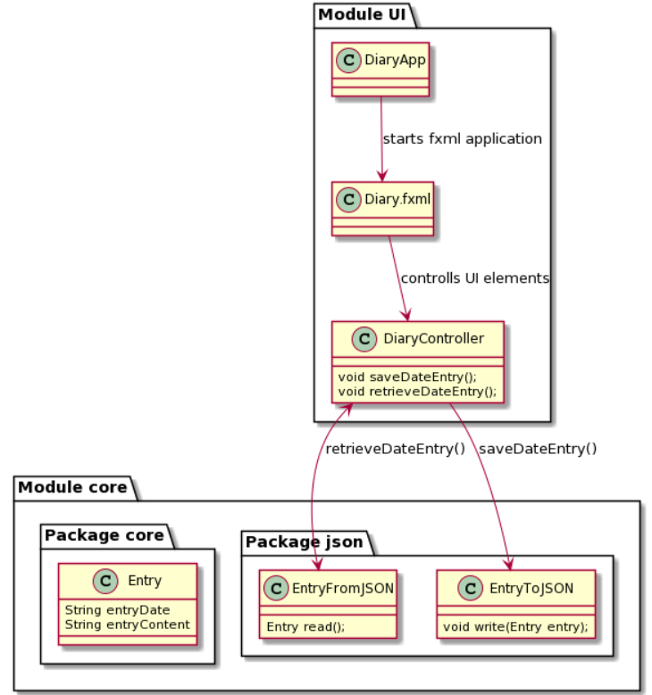

# Group2172 README 

Greetings!

 
Welcome to the project of group 2172 Fall 2021.

 
 
This project creates a simple diary-application that allowes the user to write diary entries, save and load them.
 
The root-folder of the project is the toplevel of the repository. Because of this we have combined the two README-files.
 

Here's an illustration of how it would look, for now.
 

 

Here's an illustration of the current architecture:
 

# How to build and run applicaiton
This project utilize maven to build and run the code.
Build the project by using `mvn clean install` inside the diary folder, then the UI can be initialized using the `mvn javafx:run -f ui/pom.xml` command.

## Running the application
### **Gitpod**
Gitpod is configured to automatically select the diary directory, application will run using the following:
~~~
mvn clean install
mvn javafx:run -f ui/pom.xml
~~~

### **Local**
For a local project you first need to select the diary directory then use the same commands as for Gitpod. Run the following commands:
~~~
cd diary
mvn clean install
mvn javafx:run -f ui/pom.xml
~~~

# Brukerhistorier

## Diary

Som en person med mange tanker ønsker jeg å holde oversikt over alle tanker og føleleser jeg opplever om dagen. Derfor må jeg skrive ned alt jeg føler et sted for å kunne se tilbake på hendelser i livet mitt.

Brukeren ønsker å kunne velge å skrive om dagens tanker og historie. Da er det fint om man kan velge en ny, blank side til å skrive på.

Brukeren liker også å kunne gå tilbake for å se hva han eller hun følte en dag. Da er det greit å kunne bla tilbake.

### Viktig for brukeren
    - når en vil skrive skriver: Tydelig knapp for å lage en ny side.
    - om en vil se tilbake: Tydelig knapp for å bla tilbake med markering for hvilken dag det er.

